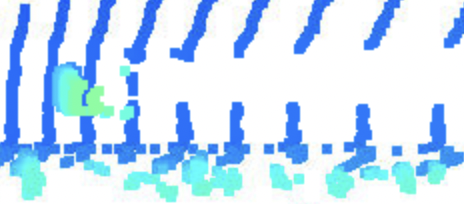

1. Visualize range image channels (ID_S1_EX1)

Convert range image “range” channel to 8bit
Convert range image “intensity” channel to 8bit
Crop range image to +/- 90 deg. left and right of the forward-facing x-axis
Stack cropped range and intensity image vertically and visualize the result using OpenCV

these are implemented in "show_range_image" method.

1. Visualize point-cloud (ID_S1_EX2)

Visualize the point-cloud using the open3d module
Within a write-up file (Markdown or PDF):

Find 10 examples of vehicles with varying degrees of visibility in the point-cloud
Try to identify vehicle features that appear stable in most of the inspected examples and describe them

usually features like rear bumper , tail/front lights and chassis are more stable features to be identified with (inspected through multiple settings and examples , and verified with later exercises of bounding boxes/ground truth) ; also, the closer the distance to the ego car, the more identifiable those features . 

3. Convert sensor coordinates to bev-map coordinates (ID_S2_EX1)
Convert coordinates in x,y [m] into x,y [pixel] based on width and height of the bev map

implemented in "bev_from_pcl" method of object_pcl.py

4. Compute intensity layer of bev-map (ID_S2_EX2)
Assign lidar intensity values to the cells of the bird-eye view map
Adjust the intensity in such a way that objects of interest (e.g. vehicles) are clearly visible

implemented in "bev_from_pcl" method of object_pcl.py

5. Compute height layer of bev-map (ID_S2_EX3)
Make use of the sorted and pruned point-cloud lidar_pcl_top from the previous task
Normalize the height in each BEV map pixel by the difference between max. and min. height
Fill the "height" channel of the BEV map with data from the point-cloud

implemented in "bev_from_pcl" method of object_pcl.py

6. Add a second model from a GitHub repo (ID_S3_EX1)
In addition to Complex YOLO, extract the code for output decoding and post-processing from the GitHub repo.

implemented in "load_configs_model" and "create_model" of object_detect.py

7. Extract 3D bounding boxes from model response (ID_S3_EX2)
Transform BEV coordinates in [pixels] into vehicle coordinates in [m]
Convert model output to expected bounding box format [class-id, x, y, z, h, w, l, yaw]

implemented in "detect_objects" of object_detect.py

8. Compute intersection-over-union (IOU) between labels and detections (ID_S4_EX1)
For all pairings of ground-truth labels and detected objects, compute the degree of geometrical overlap
The function tools.compute_box_corners returns the four corners of a bounding box which can be used with the Polygon structure of the Shapely toolbox
Assign each detected object to a label only if the IOU exceeds a given threshold
In case of multiple matches, keep the object/label pair with max. IOU
Count all object/label-pairs and store them as “true positives”

implemented in "measure_detection_performance" of object_eval.py

9. Compute false-negatives and false-positives (ID_S4_EX2)
Compute the number of false-negatives and false-positives based on the results from IOU and the number of ground-truth labels

implemented in "measure_detection_performance" of object_eval.py

10. Compute precision and recall (ID_S4_EX3)
Compute “precision” over all evaluated frames using true-positives and false-positives
Compute “recall” over all evaluated frames using true-positives and false-negatives

implemetned in "compute_performance_stats" of object_eval.py
experimented with both use_labels_as_objects set to False and True, respectively 